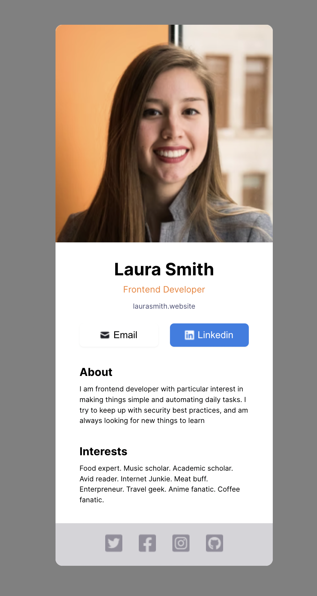

# Bob Ziroll's learn react for free course - Customized digital business card

This is a solution to the [React section 1 solo project](https://scrimba.com/learn/learnreact/react-section-1-solo-project-coce646e88eea46f91af43ca4)

## Table of contents

- [Overview](#overview)
  - [Screenshot](#screenshot)
  - [Links](#links)
  - [Built with](#built-with)
  - [What I learned](#what-i-learned)
  - [Useful resources](#useful-resources)
- [Author](#author)
- [Acknowledgments](#acknowledgments)

## Overview

- This challenge helped me grapple with my basic understanding of react and layout. The first attempt at this project didn't follow basic semantic standards, as such I reimplemented.

### Screenshot

### Links

- [Ziroll solo project](https://ziroll-project.vercel.app/)

### Built with

- Semantic HTML5 markup
- CSS custom properties
- Flexbox
- Mobile-first workflow
- [React](https://reactjs.org/) - JS library (This project was bootstrapped with [Create React App](https://github.com/facebook/create-react-app))

### What I learned

On this particular challenge, I was intentional about HTML semantics and my use of margins paddings, height, & width as regards to expanding my understanding of box model.

### Useful resources

- [Scrimba](https://scrimba.com/learn/learnreact) - This platform provided me with an opportunity to learn react for free
- [React](https://reactjs.org/) - This is an amazing web page provides you all the resources you need to put together to get your react app working perfectly on your local machine.
- [Mdn](https://developer.mozilla.org/en-US/docs/Learn/CSS/Building_blocks/The_box_model) - I used this article in getting a clearer picture as to how box model works

## Author

- Github - [@soji](https://github.com/soji-opa)

## Acknowledgments

I am very grateful to Smug & Openwell for always making time out of their busy schedules to see to my coding challenges and providing me with extra motivation.
